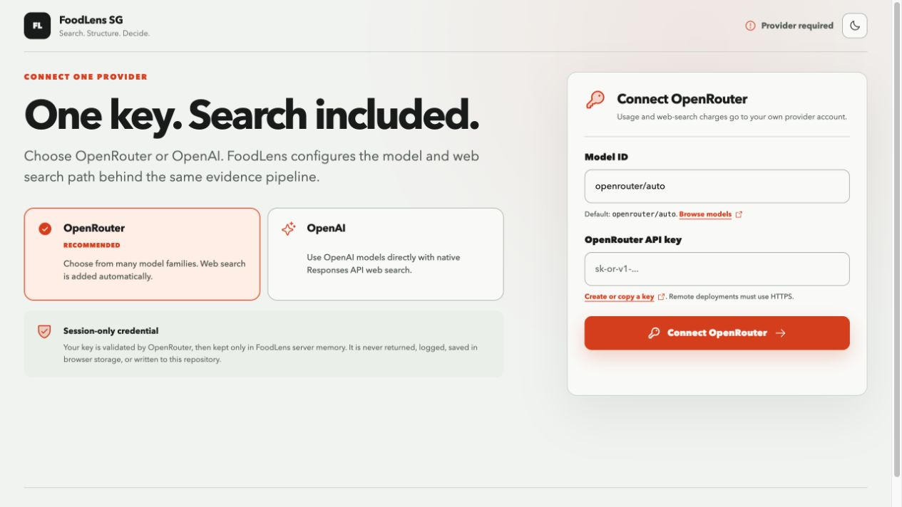
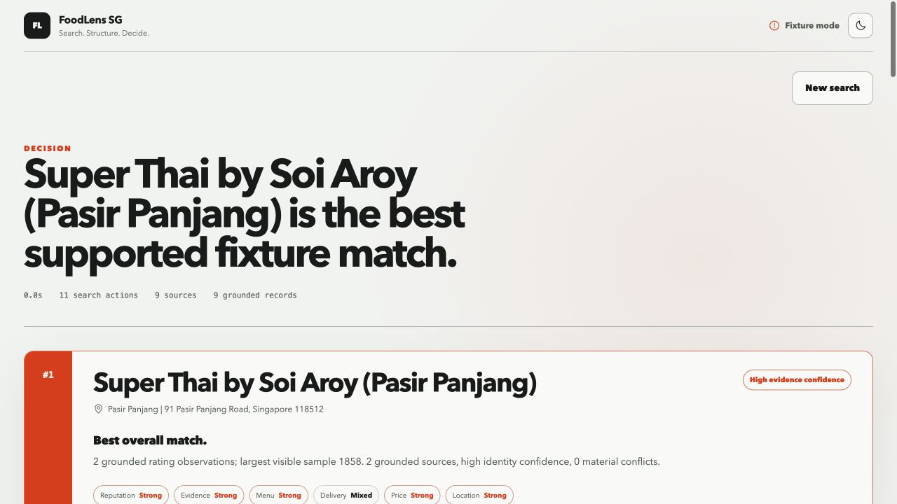

# FoodLens SG

[](https://github.com/Jeffreyliu0131/foodlens-sg/actions/workflows/ci.yml)
[](LICENSE)

FoodLens SG is a search-first, cross-platform restaurant decision agent for Singapore.

Give it a location and a natural-language food need. It searches the public web, structures branch-level evidence, reconciles identities, evaluates evidence quality, ranks candidates against the current request, and answers:

> Where should I order from, and what should I order?



The first-run experience exposes only two choices: OpenRouter or OpenAI. Each path needs one provider key and enables web search automatically.



The screenshot uses the repository's explicitly labeled, dated fixture. It demonstrates the interface and deterministic pipeline, not current restaurant advice.

## Why it exists

A restaurant decision is often scattered across several surfaces:

- discovery and distance;
- Google reputation and review volume;
- Foodpanda presence and delivery signals;
- menus, prices, and desired dishes;
- branch names that differ across sources;
- personal constraints that change from one order to the next.

The user still has to reconcile those facts and make the decision. FoodLens treats the value as **decision compression**, not another long restaurant list.

## Real-world origin

The idea came from a Thai delivery decision near Pasir Panjang. The original workflow involved discovering candidates, comparing Google and Foodpanda ratings and review volume, matching differently named branches, inspecting menus, and finally choosing both a restaurant and a dish.

That workflow became the V0 thesis:

> Can a search-enabled AI combine fragmented public restaurant evidence into a useful, reproducible decision without dedicated platform integrations?

## What V0 does

```text
Intent -> Search plan -> Broad retrieval -> Source grounding
       -> Entity resolution -> Preliminary ranking
       -> Finalist research -> Final ranking -> Recommendation
```

The core stages remain visible in the code and in the operational research trace. This is not one giant prompt.

- The model interprets natural language and searches heterogeneous public pages.
- A first-run setup lets the user choose OpenRouter or OpenAI, enter one provider key, and start without editing environment files.
- Deterministic code validates source membership, resolves branches, measures evidence confidence, applies preference weights, and checks final evidence IDs.
- A second search pass investigates only the strongest finalists.
- The final decision exposes clickable sources, uncertain matches, warnings, search actions, latency, and token usage.

See [Architecture](docs/ARCHITECTURE.md), [Evaluation](docs/EVALUATION.md), and the [Build Risk Review](docs/BUILD_RISK_REVIEW.md).

## Search-first philosophy

V0 intentionally tests public-web retrieval before adding Google Places, Foodpanda, scraping infrastructure, or a restaurant database.

FoodLens exposes two intentionally simple, single-key provider paths:

- **OpenRouter (recommended):** one OpenRouter key, a model ID, and automatic `openrouter:web_search`. The search response is followed by a separate structured extraction call so citation URLs enter the same grounding contract.
- **OpenAI:** one OpenAI key, an OpenAI model ID, and native Responses API `web_search` with search actions and URL annotations.

Both paths feed the same deterministic grounding, entity-resolution, confidence, ranking, and recommendation code. V0 does not expose a separate search API, arbitrary base URL, local-model mode, or advanced provider composition.

On the 2026-09-01 implementation date, the official OpenAI guidance recommended Responses API plus `web_search` for new search integrations. FoodLens also requests `web_search_call.action.sources` so extracted source URLs can be checked against pages the provider actually observed.

- [OpenAI Web Search documentation](https://developers.openai.com/api/docs/guides/tools-web-search)
- [OpenAI Structured Outputs documentation](https://developers.openai.com/api/docs/guides/structured-outputs)
- [OpenRouter Web Search server tool](https://openrouter.ai/docs/guides/features/server-tools/web-search)
- [OpenRouter Structured Outputs](https://openrouter.ai/docs/guides/features/structured-outputs)

## Evidence contract

FoodLens never treats these states as equivalent:

```text
listing_found
appears_open
accepting_orders
exact_address_eligible
eta_known
```

A Foodpanda listing normally establishes only `listing_found`. A page-level `CLOSED` label may be time-specific. Exact-address eligibility and ETA remain unknown unless directly supported.

Each accepted record must use a URL found in a search action or URL citation. If the extracted URL was not observed, the record is rejected and reported in the trace.

This guard proves retrieval provenance, not source correctness. Sources can still be stale, incomplete, or wrong.

## Quick start

Requirements:

- Node.js 22 or newer
- npm
- one OpenRouter or OpenAI API key

```bash
git clone https://github.com/Jeffreyliu0131/foodlens-sg.git
cd foodlens-sg
npm install
```

Then run:

```bash
npm run dev
```

Open `http://127.0.0.1:5173`.

The first screen asks the user to choose OpenRouter or OpenAI, enter one key, and confirm a model ID. The server validates the key and model, stores the credential only in an expiring in-memory session, and returns an opaque HttpOnly cookie. The key is never returned, logged, written to browser storage, added to trace output, or saved in the repository. Server restart, expiry, or “Forget session key” destroys it.

Environment variables remain available for CLI, CI, or a trusted single-user deployment. Copy `.env.example` only when that workflow is needed.

## Offline fixture mode

The repository includes an explicit fixture provider for UI review, deterministic tests, and zero-cost demos. It is not an automatic fallback and never appears as live research.

Set this in `.env`:

```dotenv
FOODLENS_PROVIDER=fixture
```

Create it from `.env.example` if needed, then run `npm run dev`. The header and warnings label the result as fixture data. The live provider never reads fixture records.

## Example request

Location:

```text
Pasir Panjang, Singapore
```

Need:

```text
I want Thai food delivery around SGD 30 or below. Strong ratings on both
Google and Foodpanda matter, especially when supported by many reviews.
I want Pad See Ew or something savory and strongly flavored, such as basil pork.
```

The current dated fixture produces a clear top choice, dish recommendations, component labels, evidence links, delivery uncertainty, branch matches, and a complete trace. The winner is not asserted as a current real-world answer and is not hardcoded into production discovery.

## Programmatic interfaces

### Streaming HTTP

`POST /api/recommend` returns newline-delimited JSON. Trace events arrive first, followed by one decision packet.

```bash
curl -N http://127.0.0.1:8787/api/recommend \
  -H 'Content-Type: application/json' \
  -d '{
    "location": "Pasir Panjang, Singapore",
    "query": "Thai delivery under SGD 30. Review volume and Pad See Ew matter."
  }'
```

Event shapes:

```json
{"type":"trace","event":{"stage":"grounding","status":"completed"}}
{"type":"result","data":{"decisionId":"decision_...","recommendations":[]}}
```

`GET /api/health` reports provider readiness and the configured model without exposing credentials.

Provider setup endpoints:

- `GET /api/config` returns session-safe provider state;
- `POST /api/config` validates and binds one OpenRouter or OpenAI key;
- `DELETE /api/config` destroys the session key and clears the cookie.

### CLI

```bash
npm run cli -- \
  --location "Pasir Panjang, Singapore" \
  --query "Thai delivery under SGD 30. Review volume and Pad See Ew matter."
```

Add `--json` for the complete decision packet.

## Ranking and confidence

There is no universal best restaurant. FoodLens extracts relative priorities for:

- reputation;
- evidence quality;
- menu and dish fit;
- delivery fit;
- budget fit;
- location fit.

The application normalizes those weights and applies them deterministically.

Review count affects rating reliability with a logarithmic cap. Moving from 30 to 300 reviews matters much more than moving from 3,000 to 3,270. A 4.9 rating with 30 reviews therefore does not automatically beat a 4.7 rating with 3,000 reviews.

The UI shows coarse labels such as `strong`, `solid`, `mixed`, `limited`, and `unknown`. It does not present the internal heuristic as a scientific probability.

## Key engineering problems

### Retrieval recall

Ranking cannot recover a restaurant the search never discovers. Broad candidate discovery and deep finalist verification are separate passes.

### Heterogeneous evidence

Foodpanda pages, official menus, Google-related aggregators, and restaurant sites expose different fields and freshness. FoodLens converts them into one source-record schema without filling missing values.

### Cross-platform identity

Automatic merges require compatible names plus branch evidence such as postal code, normalized address, neighborhood, or phone. Generic chain pages and conflicting postal codes remain uncertain.

### Evidence quality

Rating, review sample, source independence, conflicts, branch confidence, and missing evidence all affect the confidence band.

### Grounded generation

Final recommendations may cite only validated evidence IDs. Dish names are checked against cited menu claims. Ungrounded generated dishes are discarded and replaced by deterministic evidence-backed output.

## Evaluation

Run the deterministic suite:

```bash
npm run check
npm test
npm run eval:fixture
npm run build
```

Run the live Thai scenario when either provider is configured through environment variables:

```bash
npm run eval:live
```

The live eval checks candidate count, source count, claim grounding, recommendation evidence IDs, a clear top choice, search actions, latency, and usage. Historical restaurant names are reported only as dated recall context. They do not determine pass/fail ranking. A browser session key is deliberately not readable by the CLI.

## Repository map

```text
src/
  core/          grounding, resolution, ranking, recommendation, pipeline
  providers/     OpenRouter, OpenAI, validation, and fixture adapters
  server/        provider sessions, config API, NDJSON API, static server
  shared/        Zod contracts and TypeScript types
  web/           React decision UI and inspection surfaces
tests/           deterministic component and pipeline tests
evals/           realistic fixture and live evaluation runners
docs/            architecture, evaluation, risk review, and UI asset
```

## Limitations

- Search-index coverage is incomplete and can change without notice.
- Google reputation may come from an aggregator instead of a direct Google Maps page.
- Foodpanda pages may expose a listing, rating, or menu without exact-address delivery eligibility.
- Current order acceptance and ETA often cannot be independently confirmed.
- Menu prices, ratings, review counts, and branches change over time.
- Sources can conflict or repeat the same upstream data.
- Search-enabled model calls add latency and variable cost.
- OpenRouter's Web Search server tool is currently Beta and may change.
- OpenRouter normally uses two more model calls than OpenAI because search citations are structured in a separate extraction step.
- Browser-connected keys are session-only and disappear on server restart; durable hosted secret storage is not implemented.
- Remote hosting must use HTTPS. The in-memory session store is not horizontally scalable.
- Natural-language intent extraction and evidence extraction can still be wrong.
- The rating and ranking formulas are product heuristics, not objective restaurant quality measurements.
- No live OpenAI or OpenRouter E2E result is claimed until `npm run eval:live` is actually run with a valid key.

## Non-goals

V0 does not include accounts, checkout, ordering, payments, restaurant-owner tools, a persistent restaurant database, a durable hosted secret vault, arbitrary provider URLs, separate search APIs, local-model setup, browser automation, CAPTCHA bypass, private API reverse engineering, proxy infrastructure, a vector database, multi-country support, or dedicated platform adapters.

## Future possibilities

Future work is intentionally separate from V0:

- Google Places adapter;
- delivery-platform adapters;
- other Singapore delivery services;
- preference memory;
- MCP interface;
- repeated live eval datasets;
- expansion beyond Singapore.

These are roadmap options, not implemented claims.

## Contributing

Read [CONTRIBUTING.md](CONTRIBUTING.md). New providers must produce the same source-record contract. Any change to grounding, identity resolution, or ranking needs a deterministic regression test and an explicit failure case.

## Project status and provenance

- Status: OpenRouter and OpenAI single-key product paths implemented; live-provider E2E pending real keys
- Public repository: https://github.com/Jeffreyliu0131/foodlens-sg
- Started: 2026-09-01
- Geography: Singapore
- Persistent restaurant database: none
- License: MIT

The product problem, original scenario, V0 thesis, requirements, and evaluation intent came from the user's real decision and product brief. Codex implemented the initial repository under that brief.

The existence of this artifact does not by itself prove independent product or engineering capability. That requires the user's later explanation, modification, debugging, test ownership, and real-world validation.
